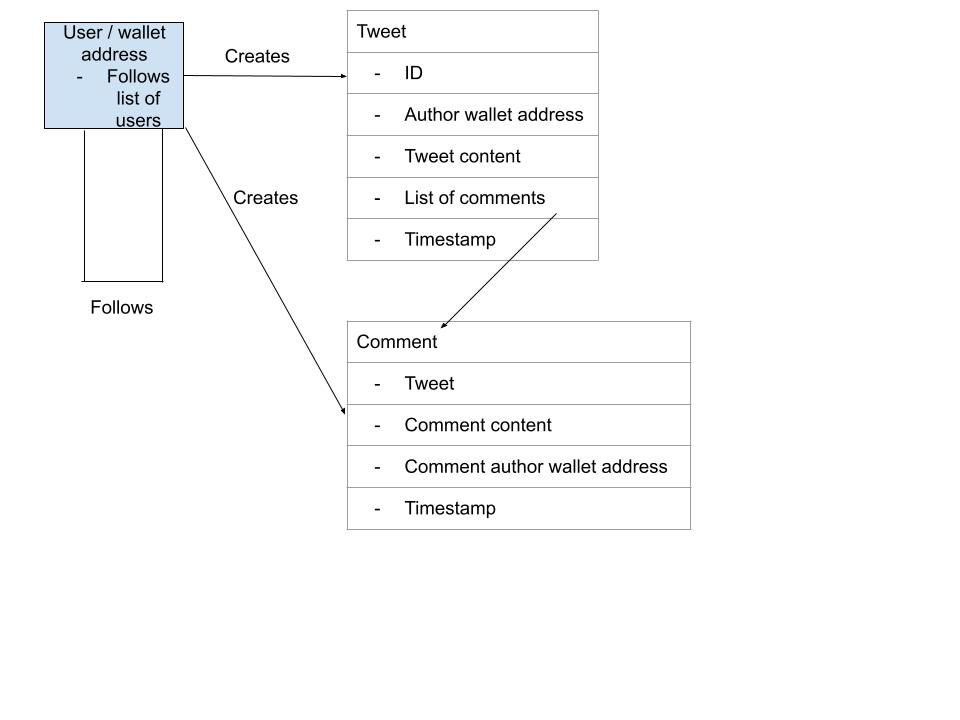

# gno-twitter

## Supported Operations

The three supported operations are:
- Create post
- Comment on post
- Follow user

## Supported renderings

Supported html renderings are mapped below, URL -> data displayed.

- `.../twitter` -> displays a list of all users addresses that have posted a tweet or comment
- `.../twitter:users` -> same as previous
- `.../twitter:users/<user address>` -> displays the number of users they follow and a list of condensed tweets, ordered by newest
- `.../twitter:users/<user address>/follows` -> displays a list of all users the user with this address follows
- `.../twitter:tweets/<tweet id>` -> displays a full tweet and all comments, ordered by oldest

## Testing
